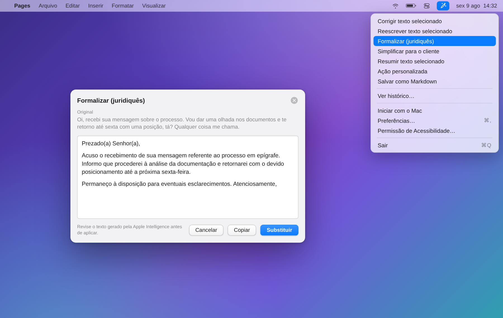
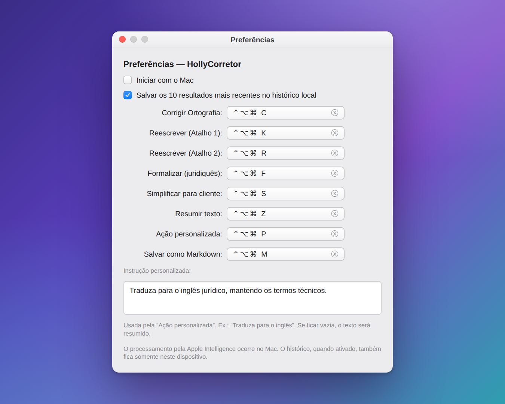

# HollyCorretor

[](https://github.com/HollyGM/HollyCorretor/actions/workflows/ci.yml)
[](LICENSE)
[](#compatibilidade)
[](Package.swift)

Aplicativo de barra de menus para macOS que corrige, reescreve, formaliza,
simplifica ou resume o texto selecionado. O processamento usa o modelo local da
Apple Intelligence por meio do framework Foundation Models; o texto não é enviado
a uma API de terceiros.

<p align="center">
  
</p>

<p align="center">
  <em>Painel de prévia da ação <strong>Formalizar (juridiquês)</strong> com o menu da barra de status aberto.
  Todo resultado é revisado antes de substituir o texto original.</em>
</p>

Versão atual: **0.2.0** — consulte o [histórico de versões](CHANGELOG.md).

## Compatibilidade

- macOS 26 (Tahoe) ou posterior.
- Mac com Apple Silicon compatível com Apple Intelligence.
- Apple Intelligence ativada e com o modelo local concluído.
- Um MacBook com chip M5 atende ao requisito de arquitetura; a disponibilidade
  final também depende da versão do macOS, da região e das configurações da Apple
  Intelligence.

O aplicativo ainda não funciona no Windows ou Linux. A interface, os atalhos
globais, a leitura da seleção e o modelo de IA usam APIs exclusivas do macOS. A
lógica independente dessas APIs está no módulo `HollyCore`, que compila
separadamente e serve de base para futuros clientes de outras plataformas.

## Ações e atalhos iniciais

Todos os atalhos usam `Control + Option + Command` mais a tecla indicada e podem
ser alterados em **Preferências**.

| Ação | Tecla | Resultado |
|---|---:|---|
| Corrigir ortografia | `C` | Corrige ortografia, gramática, acentuação e pontuação. |
| Reescrever | `K` ou `R` | Melhora clareza, fluidez e estrutura. |
| Formalizar | `F` | Adapta para linguagem jurídica formal. |
| Simplificar | `S` | Torna o texto acessível para quem não tem formação jurídica. |
| Resumir | `Z` | Gera um resumo executivo com decisões, prazos e próximos passos. |
| Ação personalizada | `P` | Aplica a instrução definida em Preferências. |
| Salvar como Markdown | `M` | Abre uma janela para salvar a seleção em um arquivo `.md`. |

## Interface

O HollyCorretor vive na barra de menus, sem ícone no Dock. Ao acionar uma ação —
por atalho, pelo ícone da barra de menus ou pelo menu **Serviços** — o resultado
aparece em um painel de prévia editável sobre o aplicativo em uso; nada é
substituído sem confirmação.

Os atalhos, a instrução da **Ação personalizada** e o histórico local são
ajustados em **Preferências**:

<p align="center">
  
</p>

## Como compilar e usar

É necessário ter as Command Line Tools da Apple ou o Xcode com o SDK do macOS 26
ou posterior.

```bash
git clone https://github.com/HollyGM/HollyCorretor.git
cd HollyCorretor
./scripts/run.sh
```

O script compila o app, cria `dist/HollyCorretor.app`, aplica uma assinatura local,
registra os itens do menu Serviços e abre o aplicativo.

No primeiro uso:

1. Autorize o HollyCorretor em **Ajustes do Sistema › Privacidade e Segurança ›
   Acessibilidade**.
2. Selecione o texto em um aplicativo compatível.
3. Use um atalho, uma ação no ícone da barra de menus ou um item de
   **Serviços › HollyCorretor**.
4. Revise o resultado na prévia.
5. Escolha **Substituir**, **Copiar** ou **Cancelar**.

O HollyCorretor nunca envia a mensagem automaticamente.

## Privacidade e segurança

- O modelo padrão roda no dispositivo por meio da Apple Intelligence.
- O aplicativo não contém chaves de API nem implementa chamadas de rede em tempo
  de execução.
- Os 10 resultados mais recentes são salvos localmente por padrão. Essa opção pode
  ser desativada em Preferências, e o histórico pode ser apagado pelo menu.
- O histórico local não é criptografado pelo próprio aplicativo. Para textos
  sigilosos, desative-o.
- O conteúdo anterior da área de transferência só é restaurado se ela não tiver
  sido alterada novamente; assim, uma cópia feita durante o processamento não é
  sobrescrita.

Para relatar uma vulnerabilidade sem expor detalhes publicamente, consulte a
[política de segurança](SECURITY.md).

## Limitações de uso

Resultados produzidos por modelos generativos podem conter erros, omissões ou
alterações indesejadas. Todo resultado deve ser revisado antes de ser substituído,
copiado ou utilizado. A ação de formalização auxilia a redação, mas não constitui
parecer jurídico nem valida fatos, fundamentos ou conclusões.

## Desenvolvimento

```bash
./scripts/test.sh
./scripts/build.sh
```

Estrutura principal:

- `Sources/HollyCore`: regras, divisão segura de textos e limpeza de respostas;
- `Sources/HollyCorretor`: integração com Apple Intelligence e recursos do macOS;
- `Tests/HollyCoreChecks`: testes automatizados do núcleo portátil;
- `Resources/Info.plist`: metadados do app e declaração dos Serviços do macOS;
- `scripts`: compilação, empacotamento e execução local.

O fluxo do GitHub Actions executa testes e uma compilação de produção em macOS 26.
As orientações para propostas de alteração estão em [CONTRIBUTING.md](CONTRIBUTING.md).

## Dependência de terceiros

O projeto utiliza `KeyboardShortcuts` 1.15.0, de Sindre Sorhus, distribuído sob a
Licença MIT. As atribuições e o texto aplicável estão em
[THIRD_PARTY_NOTICES.md](THIRD_PARTY_NOTICES.md).

## Distribuição

O pacote gerado localmente recebe apenas uma assinatura ad hoc. Para distribuir um
binário pronto a outras pessoas sem alertas do Gatekeeper, ainda será necessário
usar uma conta Apple Developer, assinatura Developer ID e notarização. O código
fonte pode ser compilado localmente sem essas credenciais.

## Licença

O código original do HollyCorretor é disponibilizado sob a
[Apache License 2.0](LICENSE). Componentes de terceiros permanecem sujeitos às
respectivas licenças; consulte [THIRD_PARTY_NOTICES.md](THIRD_PARTY_NOTICES.md).
