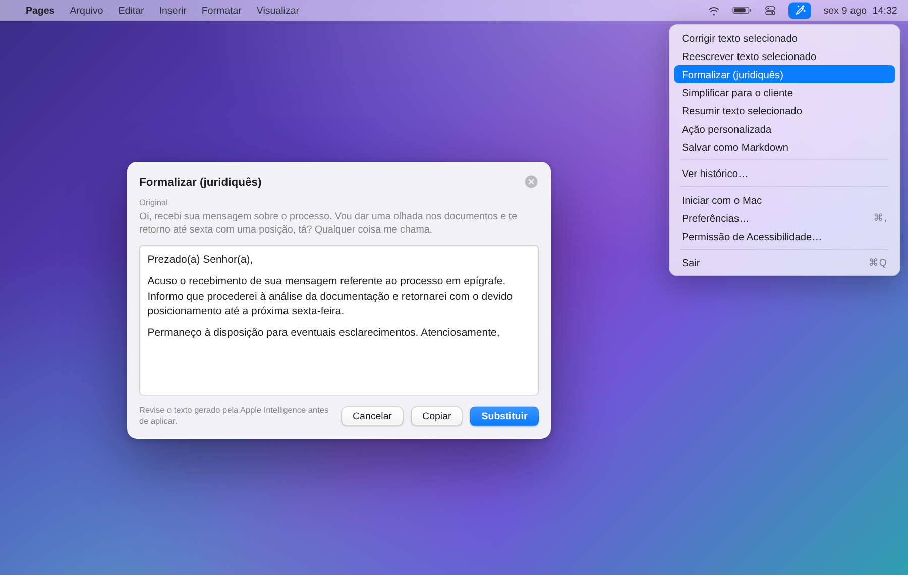
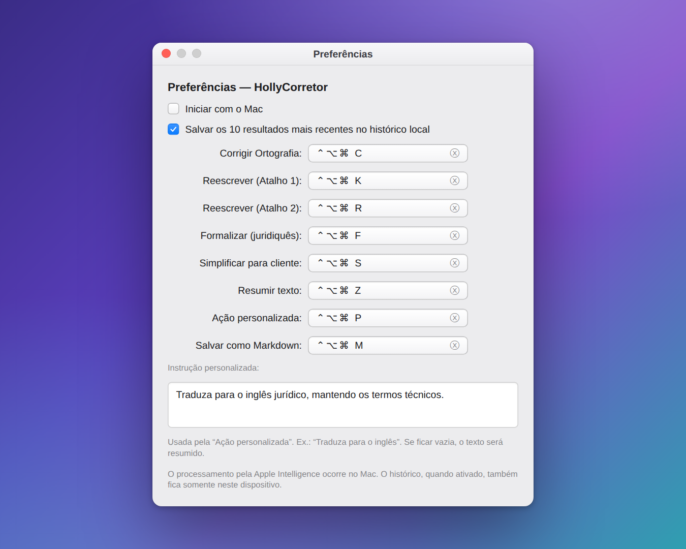

<p align="center">
  
</p>

<p align="center">
  <strong>Correção, reescrita, formalização e resumo no macOS.</strong><br>
  Apple Intelligence · Privacidade por padrão · Revisão antes da substituição
</p>

<p align="center">
  <a href="https://github.com/HollyGM/HollyCorretor/actions/workflows/ci.yml"></a>
  <a href="LICENSE"></a>
  
  
</p>

> **Parte da suíte Holly**  
> Ferramentas local-first para texto, documentos e mídia, com privacidade por padrão e segurança verificável.  
> [HollyOCR](https://github.com/HollyGM/HollyOCR) · [HollyTranscrição](https://github.com/HollyGM/HollyTranscricao) · [HollyOptimizer](https://github.com/HollyGM/HollyOptimizer)

Aplicativo de barra de menus para macOS que corrige, reescreve, formaliza,
simplifica ou resume o texto selecionado. O processamento usa o modelo local da
Apple Intelligence por meio do framework Foundation Models; o texto não é enviado
a uma API de terceiros.

<p align="center">
  
</p>

<p align="center">
  <em>Painel de prévia da ação <strong>Formalizar (juridiquês)</strong> com o menu da barra de status aberto.
  Nos editores que não permitem a aplicação direta, o resultado é revisado nesta prévia antes de substituir o texto original.</em>
</p>

Versão atual: **0.4.0** (compilação 4) — consulte o [histórico de versões](CHANGELOG.md).

## Compatibilidade

- macOS 26 (Tahoe) ou posterior.
- Mac com Apple Silicon compatível com Apple Intelligence.
- Apple Intelligence ativada e com o modelo local concluído.
- Um MacBook com chip M5 atende ao requisito de arquitetura; a disponibilidade
  final também depende da versão do macOS, da região e das configurações da Apple
  Intelligence.
- A versão 0.4.0 foi validada no macOS 27.2 com o Swift 6.4.

O aplicativo ainda não funciona no Windows ou Linux. A interface, os atalhos
globais, a leitura da seleção e o modelo de IA usam APIs exclusivas do macOS. A
lógica independente dessas APIs está no módulo `HollyCore`, que compila
separadamente e serve de base para futuros clientes de outras plataformas.

## Como acionar

A forma principal é o **menu de clique direito**: selecione o texto, clique com o
botão direito e escolha **Serviços › HollyCorretor…**. Um painel flutuante reúne
as ações de revisão e reescrita num visual semelhante às Ferramentas de Escrita
da Apple.

O menu de Serviços depende de o aplicativo de origem oferecê-lo, o que vale para
os aplicativos nativos do macOS — Mail, Notas, Pages, Word — mas não para todos
os feitos em Electron.

Para alcançar também esses, existe a opção **Botão ao selecionar texto**, que faz
uma pastilha do HollyCorretor aparecer ao lado de qualquer seleção, em qualquer
aplicativo. Ela nasce desligada, porque exige monitorar o mouse em todo o
sistema; ligue-a no menu da barra ou em Preferências se precisar. A pastilha fica
presa ao aplicativo, ao campo e ao trecho em que nasceu: trocar de aplicativo ou
de campo, inclusive pelo teclado, a invalida.

Na primeira instalação, o macOS pode deixar um Serviço de terceiros desmarcado.
Se **HollyCorretor…** não aparecer, ative-o uma vez em **Ajustes do Sistema ›
Teclado › Atalhos de Teclado › Serviços › Texto**.

## Pela Siri e pelo app Atalhos

Há dois caminhos. O primeiro funciona em qualquer instalação.

**Atalhos chamados pelo nome.** Rode uma vez:

```bash
./scripts/atalhos-siri.sh
```

O script cria cinco atalhos no app Atalhos — **Revisar com Holly**,
**Reescrever com Holly**, **Formalizar com Holly**, **Simplificar com Holly** e
**Resumir com Holly** — e o app pede a confirmação de cada um. Depois, selecione
um texto em qualquer aplicativo e diga, por exemplo, *"E aí Siri, revisar com
Holly"*. Cada atalho apenas abre o endereço `hollycorretor://revisar` (ou o da
ação correspondente), e o resultado passa pela mesma conferência dos atalhos de
teclado.

O endereço também atende lançadores, o Terminal (`open hollycorretor://resumir`)
e qualquer automação. Ações aceitas: `revisar`, `reescrever`, `formalizar`,
`simplificar`, `resumir`, `amigavel`, `profissional`, `conciso`,
`pontos-principais`, `lista`, `tabela`, `personalizada` e `markdown`. O
endereço não aceita instruções livres: qualquer página da web pode abrir um
endereço, e ela não deve poder ditar o que fazer com o seu texto.

**Ações nativas (App Intents).** O app também traz as ações no padrão da Apple:
**Revisar**, **Reescrever**, **Formalizar**, **Simplificar** e **Resumir texto
selecionado**, com frases prontas para a Siri (*"Revisar texto com o
HollyCorretor"*, *"Corrigir com o HollyCorretor"*…); **Aplicar ação ao texto
selecionado**, com a ação como parâmetro; e **Processar texto**, que recebe um
texto de outra etapa do atalho e devolve o resultado sem tocar em documento
nenhum. O macOS só executa App Intents de aplicativos assinados com certificado
emitido pela Apple: com o certificado local descrito em
[Assinatura](#assinatura-e-a-permissão-de-acessibilidade), o serviço do sistema
(`linkd`) recusa a conexão. Por isso o `build.sh` só inclui essas ações quando a
assinatura tem Team ID, em vez de anunciar ações que falhariam. Veja abaixo como
obter um certificado gratuito.

## Ações e atalhos iniciais

Todos os atalhos usam `Control + Option + Command` mais a tecla indicada e podem
ser alterados em **Preferências**.

| Ação | Tecla | Resultado |
|---|---:|---|
| Corrigir ortografia | `C` | Corrige ortografia, gramática, acentuação e pontuação. |
| Reescrever | `K` ou `R` | Melhora clareza, fluidez e estrutura. |
| Formalizar | `F` | Adapta para linguagem jurídica formal. |
| Simplificar | `S` | Torna o texto acessível para quem não tem formação jurídica. |
| Resumir | `Z` | Gera um resumo executivo com decisões, prazos e próximos passos. |
| Ação personalizada | `P` | Aplica a instrução definida em Preferências. |
| Salvar como Markdown | `M` | Abre uma janela para salvar a seleção em um arquivo `.md`. |

O painel do clique direito traz ainda um campo para descrever a alteração com as
próprias palavras e as ações **Amigável**, **Profissional**, **Conciso**,
**Pontos Principais**, **Lista** e **Tabela**, que não têm atalho.

## Interface

O HollyCorretor vive na barra de menus, sem ícone no Dock. Ao acionar uma ação —
por atalho, pelo ícone da barra de menus ou pelo menu **Serviços** — um indicador
compacto acompanha a geração, que pode ser cancelada até o resultado ser
aplicado. Quando o editor permite uma troca segura pela Acessibilidade, o
resultado entra direto no documento, com uma barra contextual para comparar o
original, **Reverter** ou confirmar com **OK**. Nos demais editores, aparece uma
prévia editável com **Substituir**, **Copiar** e **Cancelar**; nada é colado às
cegas.

Os atalhos, a instrução da **Ação personalizada** e o histórico local são
ajustados em **Preferências**:

<p align="center">
  
</p>

## Como compilar e usar

É necessário ter as Command Line Tools da Apple ou o Xcode com o SDK do macOS 26
ou posterior (Swift 6.0 ou mais recente). Para rodar no macOS 27, compile com o
Swift 6.4 e o SDK do macOS 27: só com eles o app reconhece os erros que o
framework passou a lançar nessa versão e pode usar o Private Cloud Compute.

```bash
git clone https://github.com/HollyGM/HollyCorretor.git
cd HollyCorretor
./scripts/run.sh
```

O script compila o app, cria `dist/HollyCorretor.app`, aplica uma assinatura local,
registra os itens do menu Serviços e abre o aplicativo.
Quando existe uma cópia em `/Applications/HollyCorretor.app`, prepara e verifica
a atualização antes de encerrar a versão em uso, instala a nova cópia e descarta
a de `dist/`. Se a instalação falhar, restaura a cópia anterior. No Finder, um
duplo clique em `build_and_run.command` executa o mesmo script.

No primeiro uso:

1. Autorize o HollyCorretor em **Ajustes do Sistema › Privacidade e Segurança ›
   Acessibilidade**.
2. Confirme que **HollyCorretor…** está marcado em **Ajustes do Sistema ›
   Teclado › Atalhos de Teclado › Serviços › Texto**.
3. Selecione o texto em um aplicativo compatível.
4. Clique com o botão direito sobre a seleção, escolha **Serviços ›
   HollyCorretor…** e selecione uma ação no painel. Também dá para usar um atalho
   de teclado ou o ícone da barra de menus.
5. O resultado aparece no próprio documento; use a barra contextual para
   comparar o original, **Reverter** ou confirmar com **OK**.
6. Em editores que não permitem a aplicação direta com segurança, use a prévia
   para **Substituir**, **Copiar** ou **Cancelar**.

O HollyCorretor nunca envia a mensagem automaticamente.

## Privacidade e segurança

- O modelo padrão roda no dispositivo por meio da Apple Intelligence.
- O aplicativo não contém chaves de API nem implementa chamadas de rede em tempo
  de execução.
- O histórico **nasce desligado**. Quando ativado em Preferências, guarda os 10
  resultados mais recentes em `~/Library/Application Support/HollyCorretor/`,
  em arquivo com permissão restrita e proteção de dados — não mais em texto
  claro dentro do plist de preferências. Pode ser apagado em **Ver histórico…**,
  no menu da barra, o que remove também cópias antigas deixadas por versões
  anteriores.
- O envio ao Private Cloud Compute também nasce desligado e só está disponível
  no macOS 27. Com a opção ativada, apenas textos que não cabem no modelo local
  saem do aparelho, rumo aos servidores da Apple. Para material sob sigilo,
  mantenha-a desligada.
- Quando o aplicativo de origem expõe o campo pela API de Acessibilidade, o
  resultado é escrito direto nele e a área de transferência não é tocada.
- Antes de escrever, o aplicativo confere se o campo, o intervalo e o texto da
  seleção original continuam os mesmos, para não atingir outra ocorrência do
  mesmo trecho nem outro campo. Se algo mudou, mostra a prévia ou deixa o
  resultado na área de transferência para colar com ⌘V.
- No caminho alternativo, que usa a área de transferência, o conteúdo anterior
  só é restaurado se ela não tiver sido alterada novamente; assim, uma cópia
  feita durante o processamento não é sobrescrita.

## Limites do modelo local

Numa tarefa de transformação, o modelo on-device devolve no máximo cerca de
2.400 caracteres por resposta. Textos maiores são divididos automaticamente em
blocos — preferindo fim de parágrafo, quebra de linha e fim de frase, nessa
ordem — e recompostos ao final, preservando os espaços e as quebras de linha da
fronteira entre eles. O aplicativo ainda confere o tamanho de cada resposta e
refaz o bloco dividido se o modelo tiver condensado o texto em vez de
transformá-lo. Nas ações que preservam o conteúdo, se a resposta continuar abaixo
do limite mínimo e o bloco já não puder ser dividido, o aplicativo informa a
falha e mantém o texto de origem.

Esse teto vem da fidelidade da saída, não da janela de contexto, que é bem maior
(8.192 tokens). Para resumos, em que encurtar é o resultado desejado, os blocos
podem ser bem maiores.

Para relatar uma vulnerabilidade sem expor detalhes publicamente, consulte a
[política de segurança](SECURITY.md).

## Limitações de uso

Resultados produzidos por modelos generativos podem conter erros, omissões ou
alterações indesejadas. Todo resultado deve ser revisado antes de ser substituído,
copiado ou utilizado. A ação de formalização auxilia a redação, mas não constitui
parecer jurídico nem valida fatos, fundamentos ou conclusões.

## Desenvolvimento

```bash
./scripts/test.sh
./scripts/build.sh
```

O `test.sh` executa as verificações do núcleo (`swift run HollyCoreChecks`). O
`build.sh` gera e assina `dist/HollyCorretor.app` sem instalar nada em
`/Applications`; a instalação fica a cargo do `run.sh`. As Command Line Tools
não trazem a etapa do Xcode que extrai os metadados das App Intents
(`Metadata.appintents`); o `build.sh` os obtém do próprio binário
(`HollyCorretor --gerar-metadados-app-intents <pasta>`), que confere cada nome
de tipo contra o código compilado. A versão e o número de
compilação vêm de `Resources/Info.plist`, e as variáveis `HOLLY_VERSION` e
`HOLLY_BUILD_NUMBER` os substituem numa compilação específica.

Estrutura principal:

- `Sources/HollyCore`: regras das ações, divisão segura de textos, orçamento dos
  blocos e limpeza e validação das respostas;
- `Sources/HollyCorretor`: integração com Apple Intelligence e recursos do macOS;
- `Sources/HollyCorretor/Intents`: ações da Siri e do app Atalhos (App Intents)
  e o gerador dos metadados que o sistema lê;
- `Tests/HollyCoreChecks`: testes automatizados do núcleo portátil;
- `Resources/Info.plist`: versão, metadados do app e declaração dos Serviços do
  macOS;
- `scripts`: compilação, empacotamento, execução local e criação dos atalhos da
  Siri.

O fluxo do GitHub Actions executa os testes e uma compilação de produção no
macOS 26 e na versão mais recente disponível nos runners, além de uma auditoria
que eleva o alvo para o macOS 27 e aponta APIs depreciadas.
As orientações para propostas de alteração estão em [CONTRIBUTING.md](CONTRIBUTING.md).

## Dependência de terceiros

O projeto utiliza `KeyboardShortcuts` 1.15.0, de Sindre Sorhus, distribuído sob a
Licença MIT. As atribuições e o texto aplicável estão em
[THIRD_PARTY_NOTICES.md](THIRD_PARTY_NOTICES.md).

## Assinatura e a permissão de Acessibilidade

O macOS identifica um aplicativo autorizado pela assinatura do binário. Com
assinatura ad hoc, essa identidade muda a cada compilação, e o sistema passa a
tratar o app como se fosse outro — exigindo autorizar de novo em **Ajustes do
Sistema › Privacidade e Segurança › Acessibilidade** toda vez que você compila.

Para ter identidade estável, crie um certificado de assinatura de código. O
**Acesso às Chaves** saiu da pasta Utilitários — no macOS 27 ele fica escondido em
`/System/Library/CoreServices/Applications/` —, então o caminho mais direto é o
Terminal:

```bash
# 1. Gerar o certificado, já com a finalidade de assinatura de código
cat > /tmp/holly.cnf <<'CNF'
[ req ]
distinguished_name = dn
x509_extensions    = ext
prompt             = no
[ dn ]
CN = HollyCorretor
[ ext ]
basicConstraints       = critical,CA:false
keyUsage               = critical,digitalSignature
extendedKeyUsage       = critical,codeSigning
subjectKeyIdentifier   = hash
CNF
openssl req -x509 -newkey rsa:2048 -sha256 -days 3650 -nodes \
  -keyout /tmp/holly.key -out /tmp/holly.crt -config /tmp/holly.cnf

# O -legacy e a senha são necessários: o macOS não lê o formato novo do
# OpenSSL 3, e senha vazia faz a verificação do MAC falhar na importação.
openssl pkcs12 -export -legacy -out /tmp/HollyCorretor.p12 \
  -inkey /tmp/holly.key -in /tmp/holly.crt -name "HollyCorretor" -passout pass:holly

# 2. Importar e marcar como confiável
security import /tmp/HollyCorretor.p12 -k ~/Library/Keychains/login.keychain-db \
  -P holly -T /usr/bin/codesign
security add-trusted-cert -r trustRoot -p codeSign \
  -k ~/Library/Keychains/login.keychain-db /tmp/holly.crt

# 3. Conferir
security find-identity -v -p codesigning

# 4. Apagar os arquivos temporários; a chave privada já está no Chaveiro
rm -f /tmp/holly.cnf /tmp/holly.key /tmp/holly.crt /tmp/HollyCorretor.p12
```

Se a cópia instalada já usa um certificado disponível no Chaveiro, o script o
reutiliza automaticamente. Para escolher outra identidade ou assinar a primeira
instalação, informe o nome ou a impressão digital do certificado ao compilar:

```bash
HOLLY_SIGN_IDENTITY="Nome do certificado" ./scripts/run.sh
```

### Certificado da Apple para as ações nativas da Siri

As App Intents exigem um certificado com Team ID. Pelo que o sistema confere, um
certificado **Apple Development** — gratuito com qualquer Apple ID — deve
bastar para uso no próprio Mac (este caminho ainda não foi testado com ele):

1. Instale o Xcode pela App Store e abra **Xcode › Settings › Accounts**.
2. Adicione o seu Apple ID e, em **Manage Certificates…**, clique em **+** e
   escolha **Apple Development**.
3. Confira o nome com `security find-identity -v -p codesigning` e compile com
   ele:

```bash
HOLLY_SIGN_IDENTITY="Apple Development: seu@email (XXXXXXXXXX)" ./scripts/run.sh
```

Como a identidade muda, a permissão de Acessibilidade precisa ser concedida mais
uma vez. Nas compilações seguintes o script reaproveita o certificado da cópia
instalada e inclui as ações automaticamente. `HOLLY_APP_INTENTS=1` força a
inclusão e `HOLLY_APP_INTENTS=0` a impede.

Sem uma cópia instalada assinada com certificado e sem a variável, o script usa
assinatura ad hoc e avisa a respeito. Se o certificado da cópia instalada não
estiver disponível, a compilação é interrompida para preservar sua identidade.

A diferença aparece no requisito designado, que é o que o macOS guarda ao
autorizar o aplicativo. Com assinatura ad hoc ele fixa o `cdhash` do binário, que
muda a cada compilação; com o certificado, fixa o identificador e o certificado,
que não mudam — e a autorização de Acessibilidade sobrevive às recompilações.

## Distribuição

Para distribuir um binário pronto a outras pessoas sem alertas do Gatekeeper,
ainda será necessário usar uma conta Apple Developer, assinatura Developer ID e
notarização. O código fonte pode ser compilado localmente sem essas credenciais.

## Licença

O código original do HollyCorretor é disponibilizado sob a
[Apache License 2.0](LICENSE). Componentes de terceiros permanecem sujeitos às
respectivas licenças; consulte [THIRD_PARTY_NOTICES.md](THIRD_PARTY_NOTICES.md).
